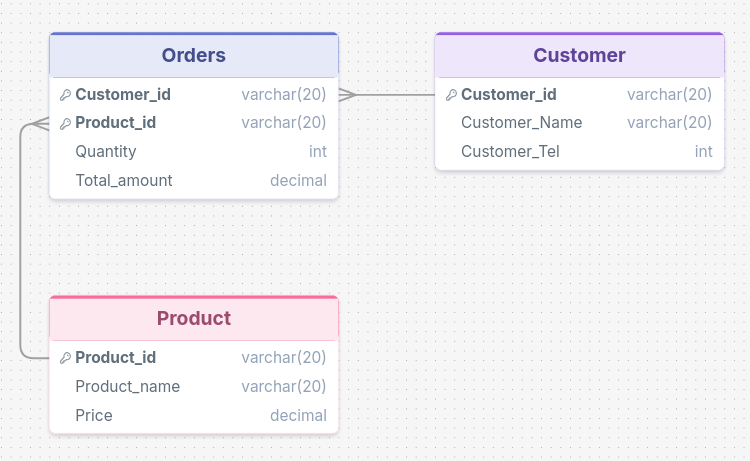

# SQL Relational Model

## Overview

This checkpoint implements the given relational model using SQL.

The database contains three tables:

- **CUSTOMER** stores customer information.
- **PRODUCT** stores product information.
- **ORDERS** stores orders and their corresponding quantities and amounts.

## Relational Model

